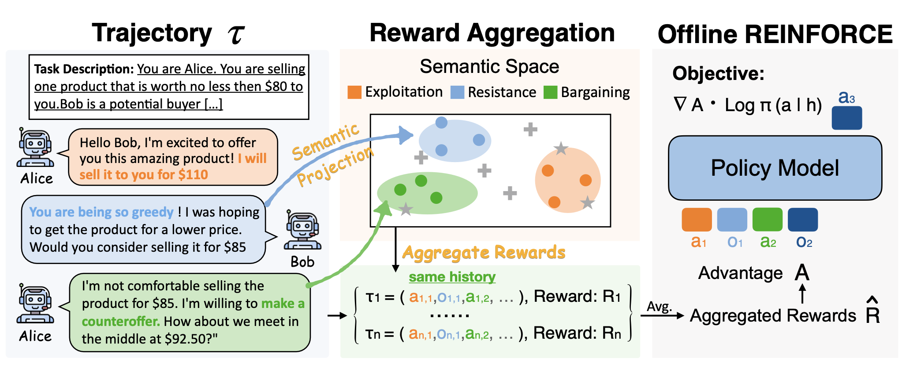

<div align="center">

# ARIA: Training Language Agents with Intention-Driven Reward Aggregation

<div>
  <a href='https://scholar.google.com/citations?user=asTSVwQAAAAJ&hl=en' target='_blank'><b>Ruihan Yang</b></a><sup>1</sup>&emsp;
  <a href='https://ykzhang721.github.io/' target='_blank'><b>Yikai Zhang</b></a><sup>1</sup>&emsp;
  <a href='https://scholar.google.com/citations?user=FAJzMAQAAAAJ&hl=en' target='_blank'><b>Aili Chen</b></a><sup>1</sup>&emsp;
</div>
<div><sup>1</sup>Fudan University</div>
<div>

<h4>

 


</h4>
</div>
</div> <!-- 关闭外层的居中div -->


## Introduction

Large language models (LLMs) have enabled agents to perform complex reasoning and decision-making through free-form language interactions. However, in open-ended language action environments (e.g., negotiation or question-asking games), the action space can be formulated as a joint distribution over tokens, resulting in an extremely large and combinatorial action space. Sampling actions in such a space can lead to extreme reward sparsity, which brings *large reward variance*, hindering *effective reinforcement learning*.

To address this, we propose **ARIA**, a method that Aggregates Rewards in Intention space to enable efficient and effective language Agents training. **ARIA** aims to project natural language actions from the high-dimensional joint token distribution space into a low-dimensional intention space, where semantically similar actions are clustered and assigned shared rewards. This intention-aware reward aggregation reduces reward variance by densifying reward signals, fostering efficient and effective policy optimization.

Extensive experiments demonstrate that **ARIA** not only significantly reduces gradient variance, but also delivers substantial performance gains of average 9.95% across four downstream tasks (e.g., negotiation and text-based games), consistently outperforming strong offline and online RL baselines.

<div align="center">



</div>

## Installation

You can install ARIA using the following steps:

```bash
# Create and activate conda environment
conda create -n aria python=3.10
conda activate aria

# Install the package
pip install -e .
```

## Data Processing Pipeline

The complete data processing pipeline transforms raw game data into training-ready datasets through several steps:

### Step 1: Generate Clustering Labels

Starting with raw game data `llama3-8b_{game}_msgs.jsonl`, generate clustering labels for different k values (k=2 to k=100):

```bash
# For different game environments
cd clustering/{game}_clustering
python clustering.py --input ../dataset/llama3-8b_{game}_msgs.jsonl --output llama3-8b_{game}_with_labels_k2_to_k100.jsonl
```

**Supported games:**
- `bargaining` (multi-agent)
- `negotiation` (multi-agent) 
- `guess_my_city` (single-agent with actions & observations)
- `twenty_questions` (single-agent with special observation processing)

### Step 2: Find Optimal K Values

Determine the optimal k values for clustering using silhouette analysis:

```bash
cd clustering

# For multi-agent games (bargaining, negotiation)
python clustering_multi.py --input llama3-8b_{game}_with_labels_k2_to_k100.jsonl

# For single-agent games (guess_my_city, twenty_questions)
python clustering_single.py --input llama3-8b_{game}_with_labels_k2_to_k100.jsonl
```

This will output the optimal k values for each agent/component.

### Step 3: Process Data with Selected K Values

Use the optimal k values to generate the final labeled dataset:

```bash
cd clustering
python game_data_processor.py {environment} {input_file} {output_file} 
```

**Examples:**

```bash
# Multi-agent games (bargaining, negotiation)
python game_data_processor.py bargaining \
    llama3-8b_bargaining_with_labels_k2_to_k100.jsonl \
    llama3-8b_bargaining_with_selected_labels.jsonl \
    --alice-k 36 --bob-k 42

python game_data_processor.py negotiation \
    llama3-8b_negotiation_with_labels_k2_to_k100.jsonl \
    llama3-8b_negotiation_with_selected_labels.jsonl \
    --alice-k 36 --bob-k 42

# Single-agent with action/observation clustering
python game_data_processor.py guess_my_city \
    llama3-8b_guess_my_city_with_labels_k2_to_k100.jsonl \
    llama3-8b_guess_my_city_with_selected_labels.jsonl \
    --action-k 36 --observation-k 28

# Single-agent with special observation processing
python game_data_processor.py twenty_questions \
    llama3-8b_twenty_questions_with_labels_k2_to_k100.jsonl \
    llama3-8b_twenty_questions_with_selected_labels.jsonl \
    --k 36
```

### Step 4: Generate Final Training Dataset

Convert the processed data into the final training format:

```bash
cd clustering
python gen_reinforce_multi.py \
    --input llama3-8b_{game}_with_selected_labels.jsonl \
    --output /ARIA/dataset/actor_reinforce_llama3-8b_multi.json
```

The final dataset will be saved to `/ARIA/dataset/actor_reinforce_llama3-8b_multi.json` and is ready for training.

## Data Processing Summary

The complete pipeline:

```
llama3-8b_{game}_msgs.jsonl
    ↓ (Step 1: clustering.py)
llama3-8b_{game}_with_labels_k2_to_k100.jsonl
    ↓ (Step 2: clustering_multi/single.py)
optimal k values
    ↓ (Step 3: game_data_processor.py)
llama3-8b_{game}_with_selected_labels.jsonl
    ↓ (Step 4: gen_reinforce_multi.py)
actor_reinforce_llama3-8b_multi.json
```

## Actor Training

```bash
cd scripts

# Offline training
python run_offline.py --config-name reinforce_llm
accelerate launch --config_file config/accelerate_config/default_config.yaml run_offline.py --config-name reinforce_llm

# Online training
python run_online.py --config-name onlinereinforce_llm
accelerate launch --config_file config/accelerate_config/default_config.yaml run_online.py --config-name onlinereinforce_llm
```

## RM Training
We train a reward model (RM) using past rollout results from the actor (updated every 50 steps) to ensure accurate advantage estimation for the actor.

```bash
cd scripts
bash train_rm.sh
```

## Contact

If you have any questions, please feel free to [email](mailto:rhyang17@fudan.edu.cn) me or drop me an issue.

## Citation
```
@article{yang2024selfgoallanguageagentsknow,
      title={ARIA: Training Language Agents with Intention-Driven Reward Aggregation}, 
      author={Yang, Ruihan and Zhang, Yikai and Chen, Aili and Wang, Xintao and Yuan, Siyu and Chen, Jiangjie and Yang, Deqing and Xiao, Yanghua},
      year={2025},
      eprint={eprint},
      archivePrefix={arXiv},
      primaryClass={cs.CL},
      url={https://arxiv.org/abs/id}, 
}
```